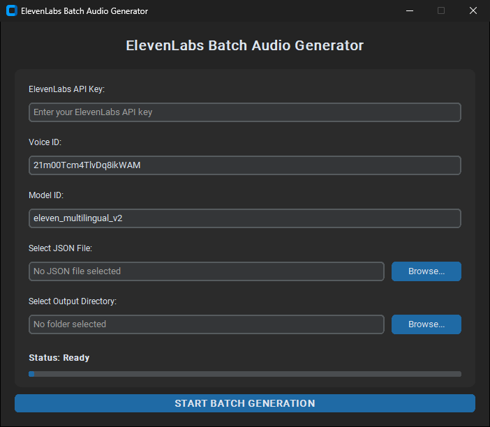

# ElevenLabs Batch TTS

A small desktop tool that converts a whole **JSON file of scripts into MP3 voiceovers** in one run, using the [ElevenLabs](https://elevenlabs.io) text-to-speech API. It's useful for content pipelines, e-learning modules, ad variations or anything else that needs many voice clips.



## Features

- Batch-converts any number of scripts from a single JSON file
- Accepts flexible JSON: a plain list, or an object with a `scripts` / `items` list
- Lets you choose the voice ID and model ID
- Retries with exponential backoff on rate limits (429) and server errors
- Stops early on an invalid API key, and reports every failed item at the end
- Progress bar with a responsive UI (network work runs on a background thread)
- The API key is typed in at runtime and **never written to disk**

## Input format

```json
{
  "scripts": [
    { "id": "intro",   "text": "Welcome to the channel..." },
    { "id": "habit_1", "text": "Habit one: plan tomorrow tonight." }
  ]
}
```

Each item becomes `audio_<id>.mp3` in the output folder. A plain list of strings also works. See [`example_scripts.json`](example_scripts.json).

## Getting started

```bash
git clone https://github.com/ZEUS91-eng/elevenlabs-batch-tts.git
cd elevenlabs-batch-tts
python -m venv venv
venv\Scripts\activate        # Windows  (macOS/Linux: source venv/bin/activate)
pip install -r requirements.txt
python elevenlabs_batch_tts.py
```

Enter your ElevenLabs API key, pick a JSON file and an output folder, then click **Start**.

## License

[MIT](LICENSE)
